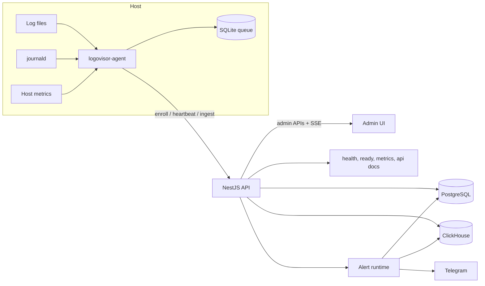

# logovisor

logovisor is a backend observability system for log collection, search, live streaming, analytics, agent monitoring, and alerting. A Go host agent tails files and/or `journald`, buffers events locally, and ships batches to a NestJS control plane; PostgreSQL stores fleet and alert state, while ClickHouse stores searchable log history. The repository showcases the data path and control path together: ingestion, token-based enrollment, heartbeats, admin APIs, analytics, and alert execution are all implemented here.

## Key Features

- **Ingestion**: file tailing, `journald` ingestion, gzip-compressed batch shipping, local SQLite buffering, resumable checkpoints
- **Fleet**: bootstrap enrollment tokens, runtime agent tokens, heartbeats, queue depth reporting, host metrics snapshots
- **Logs**: ClickHouse-backed search, cursor pagination, SSE live streaming, filters by host, agent, source, level, and query text
- **Analytics**: fleet overview, log volume over time, error heatmaps, top error messages, source/level breakdowns, system metric trends
- **Alerting**: custom DSL for log and heartbeat rules, Telegram integrations, incident tracking, acknowledge/resolve flows, silences, notification history
- **Operations**: Swagger/OpenAPI, `/health`, `/ready`, `/metrics`, retention housekeeping, Docker Compose deployment files, smoke test script

## Architecture

- `apps/api` is the control plane: operator auth, agent enrollment, heartbeat intake, log ingestion, admin APIs, analytics APIs, and alert runtime.
- `agents` is the host-side data plane: file reader, `journald` reader, SQLite queue, sender, and host metrics collector.
- `apps/admin` is a Vite-built admin SPA served by the API at `/admin/`.
- PostgreSQL stores agents, tokens, heartbeats, alert rules, incidents, silences, and notification state.
- ClickHouse stores raw log events for search and aggregates.
- `deploy/docker-compose.yml` also expects a separate frontend for `/`, but the checked-in `frontend/` directory is currently empty.



## Tech Stack

| Area | Technologies |
| --- | --- |
| API | NestJS, TypeScript, Swagger, class-validator |
| Data | PostgreSQL, Drizzle ORM, `pg`, ClickHouse |
| Agent | Go, SQLite (`modernc.org/sqlite`) |
| Admin UI | Vite, vanilla JavaScript, CSS |
| Delivery / ops | Docker Compose, Traefik, systemd unit stub |
| Tooling | Jest, ESLint, Prettier, Go test, shell smoke test |

## Repository Structure

- `apps/api` - NestJS backend and admin-serving runtime
- `apps/admin` - admin interface for fleet, logs, analytics, alerts, and token management
- `agents` - Go agent with buffering, enrollment, shipping, and host metrics
- `deploy` - Compose files, ClickHouse init SQL, smoke test, packaging and systemd assets
- `log-generator` - synthetic log producer for demos and local testing
- `frontend` - placeholder for a separate user-facing frontend expected by the full compose stack
- `ALERTS_DSL.md` - alert rule language reference

## Quick Start

The most reliable path from this checkout is a Docker-backed local dev setup: start storage and sample logs with Compose, then run the API and agent locally.

### Prerequisites

- Docker with Compose support
- Node.js and npm
- Go
- Linux if you want real `journald` ingestion

### 1. Install and configure

```bash
cp .env.example .env
npm install
```

### 2. Start dependencies

```bash
docker compose --env-file .env -f deploy/docker-compose.yml up -d postgres clickhouse log-generator
```

This avoids the checked-in `frontend/` gap while still starting the real storage layer and sample log source.

### 3. Build the admin UI and run the API

```bash
npm run admin:build
set -a && source .env && set +a
npm run api:start:dev
```

### 4. Run an agent locally

```bash
set -a && source .env && set +a
export LOGOVISOR_MASTER_URL=http://127.0.0.1:3000/api
export LOGOVISOR_BOOTSTRAP_TOKEN="$LOGOVISOR_ENROLLMENT_TOKEN"
export LOGOVISOR_HOST_ID=local-dev-host
export LOGOVISOR_LOG_FILE_PATH=/tmp/logovisor-agent.log
npm run agent:run
```

Generate a test file log:

```bash
printf 'local test error %s\n' "$(date -Iseconds)" >> /tmp/logovisor-agent.log
```

### 5. Open the system

- Admin UI: `http://127.0.0.1:3000/admin/`
- API docs: `http://127.0.0.1:3000/api/docs`
- Health: `http://127.0.0.1:3000/health`

Default operator credentials come from `.env`:

- username: `admin`
- password: `change-me`

## Main Workflows / Usage

- **Start the stack**: bring up PostgreSQL, ClickHouse, and the log generator; then run the API and one or more agents.
- **Enroll an agent**: the agent calls `POST /api/agents/enroll` with a bootstrap token and receives a runtime bearer token, which it persists in local SQLite state.
- **Ship and search logs**: the agent batches file or `journald` events to `POST /api/ingest/logs`; operators search through `GET /api/admin/logs/search`.
- **Watch live traffic**: the admin UI consumes `GET /api/admin/logs/stream` over SSE for live log streaming.
- **Monitor hosts**: heartbeats sent to `POST /api/agents/heartbeat` include queue depth and host metrics used by the fleet and analytics views.
- **Configure alerts**: create Telegram integrations, validate DSL rules, preview matches, and manage incidents, silences, and notification history under `/api/admin/alerts/*`.

## Configuration

Start with the root `.env.example`. The most important settings are:

- **Operator auth**: `LOGOVISOR_OPERATOR_USERNAME`, `LOGOVISOR_OPERATOR_PASSWORD`, `LOGOVISOR_OPERATOR_JWT_SECRET`, `LOGOVISOR_OPERATOR_COOKIE_SECURE`
- **Storage**: `POSTGRES_DB`, `POSTGRES_USER`, `POSTGRES_PASSWORD`, `CLICKHOUSE_USER`, `CLICKHOUSE_PASSWORD`, `CLICKHOUSE_DATABASE`
- **Agent behavior**: `LOGOVISOR_ENROLLMENT_TOKEN`, `LOGOVISOR_AGENT_HOST_ID`, `LOGOVISOR_HOST_LOG_DIR`, `LOGOVISOR_AGENT_LOG_FILENAME`, `LOGOVISOR_ENABLE_FILE_INPUT`, `LOGOVISOR_ENABLE_JOURNALD`, `LOGOVISOR_JOURNALD_UNITS`
- **Flow control**: `LOGOVISOR_FLUSH_INTERVAL_SECONDS`, `LOGOVISOR_HEARTBEAT_INTERVAL_SECONDS`, `LOGOVISOR_MAX_QUEUE_EVENTS`, `LOGOVISOR_MAX_QUEUE_AGE_HOURS`
- **Retention**: `LOGOVISOR_LOG_RETENTION_DAYS`, `LOGOVISOR_HEARTBEAT_RETENTION_DAYS`, `LOGOVISOR_TOKEN_RETENTION_DAYS`, `LOGOVISOR_HOUSEKEEPING_INTERVAL_SECONDS`
- **Alerting**: `LOGOVISOR_ALERTS_ENCRYPTION_SECRET`, `LOGOVISOR_ALERT_EVALUATION_INTERVAL_SECONDS`, `LOGOVISOR_ALERT_DISPATCH_INTERVAL_SECONDS`

Additional examples:

- `apps/api/.env.example`
- `apps/api/.env.local.example`
- `agents/.env.example`

## Developer Commands

```bash
npm run build
npm run test
npm run lint
npm run fmt

npm run api:start:dev
npm run api:build
npm run api:test

npm run agent:run
npm run agent:build
npm run agent:test

npm run generator:run
npm run smoke-test
```

Equivalent `make` targets exist for common API, agent, generator, and smoke-test flows.

## Operational Endpoints

- `GET /health` - liveness probe
- `GET /ready` - readiness probe for PostgreSQL and ClickHouse
- `GET /metrics` - Prometheus-style counters for enroll, heartbeat, ingest, and housekeeping
- `GET /api/docs` - Swagger UI
- `GET /api/docs-json` - OpenAPI JSON
- `GET /api/docs-yaml` - OpenAPI YAML
- `GET /admin/` - admin UI

## Documentation

- [Alert Rules DSL](./ALERTS_DSL.md)
- [Agent packaging notes](./deploy/packaging/deb/README.md)
- [Smoke test script](./deploy/smoke-test.sh)

## Current Limitations

- The separate production frontend expected by the full Compose stack is not checked in; `frontend/` is currently empty.
- Packaging for a distributable `.deb` agent is scaffolded but not implemented yet.
- API e2e coverage is still thin; the repository-level smoke test is currently the strongest end-to-end verification path.
- The metrics endpoint uses simple in-process counters rather than a full metrics client library.
